# GitHub Sakura Contributions 🌸

A live, custom GitHub contribution visualization with a Japanese Sakura / digital garden aesthetic.
This project fetches real contribution data directly from the GitHub GraphQL API, normalizes the chronological history, and renders it into a stunning, self-contained SVG without using external images. 

## Preview
*(Run the GitHub action to generate the image, then you can view it here!)*



## Features
- **Sakura Aesthetic**: A clean, premium off-white canvas featuring native SVG vectors of Sakura branches, a coastal pagoda, distant mountains, and falling animated petals.
- **Dynamic Heatmap**: Accurately fetches real GitHub contributions and maps them to a beautiful 5-tier pink color scale. Zero-contribution days remain extremely pale.
- **Subtle CSS Animations**: Falling petals, drifting clouds, and swaying blossoms powered natively inside the SVG.
- **Accessible Design**: The SVG includes full ARIA labels, and every contribution cell includes a title tooltip detailing the exact date and count.

## How It Works
1. **GitHub API Integration**: A lightweight Python engine calls the GitHub GraphQL API to fetch raw contribution data for a whole year.
2. **Data Normalizer**: Nested data is flattened and chronologically validated, mapping counts into standard contribution intensity levels.
3. **SVG Renderer**: A custom vector engine builds the visual elements mathematically from the data array.
4. **GitHub Actions Automation**: A secure workflow `.github/workflows/generate-sakura.yml` triggers nightly (`0 0 * * *`), installs Python, runs the engine, and cleanly pushes an updated `assets/sakura-contributions.svg` back to this repository if changes are detected. 

## Integration into `SamSurve` Profile README

To display this banner on your main GitHub profile (`SamSurve/SamSurve`), you can reference the raw image generated in this repository.

Add this Markdown to your `SamSurve/SamSurve` README:

```md
<div align="center">
  <picture>
    <source media="(prefers-color-scheme: dark)" srcset="https://raw.githubusercontent.com/SamSurve/contribution-universe/main/assets/sakura-contributions.svg">
    <source media="(prefers-color-scheme: light)" srcset="https://raw.githubusercontent.com/SamSurve/contribution-universe/main/assets/sakura-contributions.svg">
    
  </picture>
</div>
```
*(Make sure to adjust the repository URL if this generator repo is named differently, e.g. `github-sakura-contributions` instead of `contribution-universe`).*

## Setup Instructions (for a fresh clone)
1. Fork or clone this repository.
2. The GitHub Actions workflow is already configured to run automatically at midnight UTC.
3. You can manually trigger the generation from the **Actions** tab in your repository.
4. The workflow relies securely on the built-in `GITHUB_TOKEN` and requires no manual secret configuration. 

## Local Development
1. Ensure you have Python 3.12+ installed.
2. Install dependencies: `pip install -r requirements.txt`
3. Export your GitHub Personal Access Token (PAT) as an environment variable:
   - Linux/macOS: `export GITHUB_TOKEN="your-token-here"`
   - Windows PowerShell: `$env:GITHUB_TOKEN="your-token-here"`
4. Run the data validation test: `python -m src.main --test-data`
5. Generate the local SVG: `python -m src.main`
